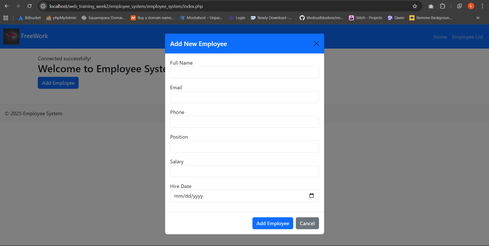
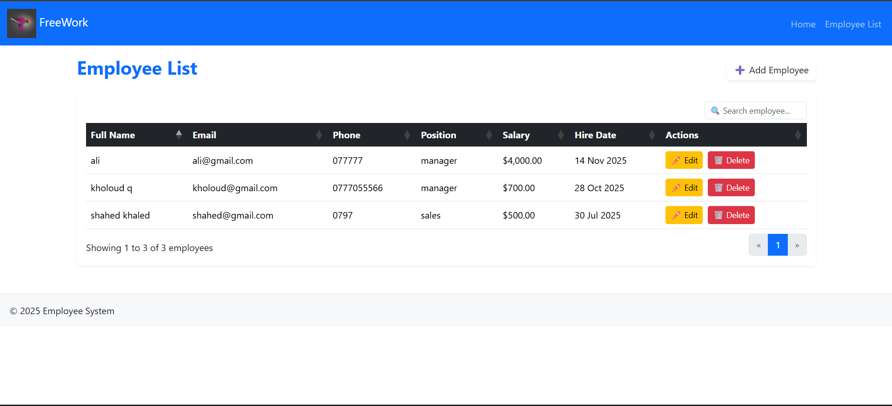
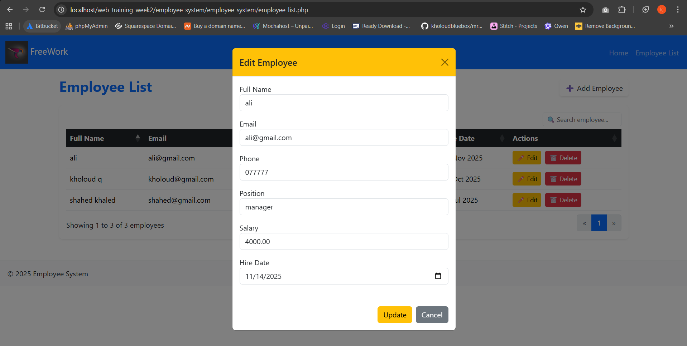
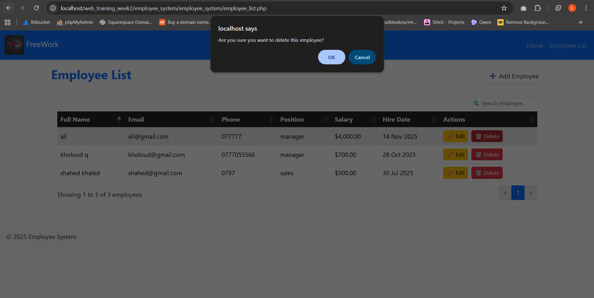
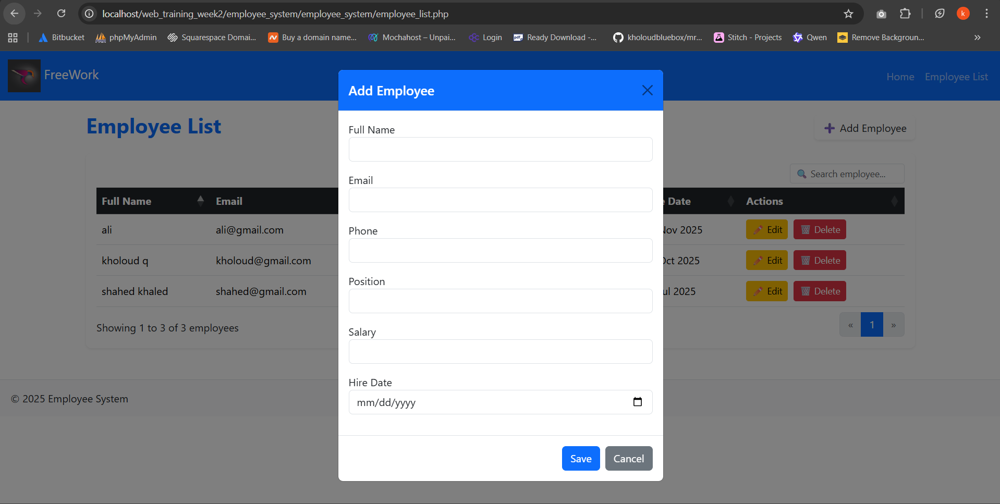

# Employee Management System

## Project Overview
A web-based system to manage employees using PHP, MySQL, and Bootstrap.

## Features
- Add new employee
- View employee list with search & sort
- Edit employee details
- Delete employee with confirmation modal
- Email duplicate validation
- Responsive design for desktop & mobile

## Installation Instructions
1. Clone the project folder
2. Import `database.sql` into MySQL
3. Run project on localhost (XAMPP)
4. Open `employee_system/employee_system/index.php` in browser

## Database Schema
| Field | Type | Description |
|-------|------|-------------|
| id | INT | Employee ID (Primary Key) |
| name | VARCHAR(100) | Full Name |
| email | VARCHAR(100) | Email |
| position | VARCHAR(100) | Job Title |
| salary | DECIMAL(10,2) | Salary |
| created_at | DATETIME | Record creation date |

## Delete Methodology
Used **Hard Delete**: permanently removes employee from database.
Reason: training project, no audit required.

## Form Implementation
Used **Bootstrap modal** 

## Screenshots

## Video Demonstration
[video showing the mechanism of the employee system](7.mp4)

## Technical Decisions
- Used **Prepared Statements** to secure the database and prevent attacks.  
- Used **Bootstrap** to make the design clean and responsive on desktop and mobile.  
- Added **Session Messages** to show success or error alerts to the user.  
- Chose **Hard Delete** to permanently remove employees because this is a training project.  
- Used **Modals** for adding or deleting employees without reloading the page for easier use.

## Final Checklist
- [ ] Add employee works
- [ ] Edit employee works
- [ ] Delete employee works
- [ ] Responsive on mobile
- [ ] No PHP errors
